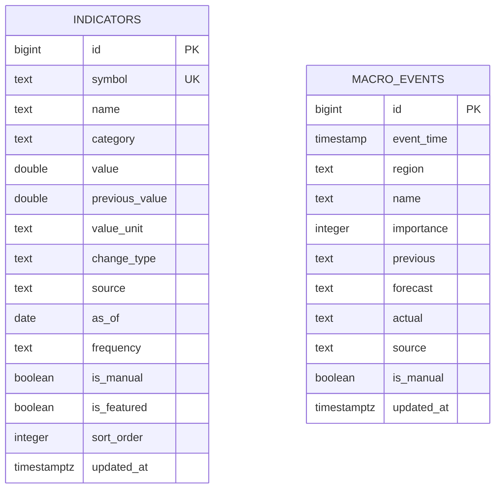

# 数据库设计

本文描述当前 PostgreSQL schema、关系与扩展约束。字段业务口径见 [数据字典](03-DATA_DICTIONARY.md)，迁移和备份操作见 [运维手册](09-OPERATIONS.md)。

## 概览

运行时数据库为 PostgreSQL，目前包含两张业务表：

- `indicators`：市场指标当前值及元数据。
- `macro_events`：宏观事件、前值、预期和实际值。

当前两张表没有外键关系。应用启动只检查连接，不自动执行 schema、迁移或种子数据。

## ER Diagram



图中没有关系线，因为当前 schema 不存在外键。未来新增关系必须通过编号迁移和 ADR 评审。

## `indicators`

### 用途

保存每项指标的最新值、前值、展示单位、变化口径、来源、业务日期和维护状态。当前模型是“每个 symbol 一条当前快照”，不是历史时序表。

### 字段

| 字段 | 类型 | Null | 默认值 | 说明 |
| --- | --- | --- | --- | --- |
| `id` | bigint identity | 否 | sequence | 主键 |
| `symbol` | text | 否 | — | 唯一指标代码 |
| `name` | text | 否 | — | 展示名称 |
| `category` | text | 否 | — | 指标分类 |
| `value` | double precision | 否 | — | 最新值 |
| `previous_value` | double precision | 否 | — | 前值 |
| `value_unit` | text | 否 | 空字符串 | 数值单位 |
| `change_type` | text | 否 | — | `bp` 或 `percent` |
| `source` | text | 否 | — | 数据来源 |
| `as_of` | date | 否 | — | 业务数据日期 |
| `frequency` | text | 否 | — | 更新频率 |
| `is_manual` | boolean | 否 | `false` | 是否人工维护 |
| `is_featured` | boolean | 否 | `false` | 是否代表性指标 |
| `sort_order` | integer | 否 | `0` | 分类内顺序 |
| `updated_at` | timestamptz | 否 | `now()` | 记录更新时间 |

### 主键、唯一约束和检查约束

- 主键：`indicators.id`。
- 唯一约束：`indicators_symbol_key`，确保 `symbol` 唯一。
- 检查约束：`indicators_change_type_check`，仅允许 `bp`、`percent`。

### Index

`indicators_category_sort_name_idx(category, sort_order, name)` 支持按分类、排序值和名称读取当前指标列表。

## `macro_events`

### 用途

保存宏观日历事件。数值字段使用 text，以保留百分号、单位、区间等原始发布格式。

### 字段

| 字段 | 类型 | Null | 默认值 | 说明 |
| --- | --- | --- | --- | --- |
| `id` | bigint identity | 否 | sequence | 主键 |
| `event_time` | timestamp without time zone | 否 | — | 事件业务时间 |
| `region` | text | 否 | — | 国家或地区 |
| `name` | text | 否 | — | 事件名称 |
| `importance` | integer | 否 | `3` | 重要性 1–5 |
| `previous` | text | 是 | — | 前值 |
| `forecast` | text | 是 | — | 预期值 |
| `actual` | text | 是 | — | 实际值 |
| `source` | text | 否 | — | 数据来源 |
| `is_manual` | boolean | 否 | `true` | 是否人工维护 |
| `updated_at` | timestamptz | 否 | `now()` | 记录更新时间 |

### 主键和检查约束

- 主键：`macro_events.id`。
- 检查约束：`macro_events_importance_check`，重要性必须在 1–5。
- 当前未定义自然键或去重约束，录入端需避免重复事件。

### Index

`macro_events_event_time_idx(event_time)` 支持按时间排序和日历读取。

## Sequence / Identity

两张表的 `id` 均使用 `GENERATED BY DEFAULT AS IDENTITY`。PostgreSQL 为 identity 列维护 sequence；常规 INSERT 不应显式传入 ID。

保留原始 ID 的迁移或恢复可能使 sequence 落后于 `MAX(id)`，导致后续主键冲突。操作原则：

1. 先只读比较最大 ID 和 sequence 状态。
2. 先在 Staging 验证。
3. 备份后在事务中同步。
4. 新增测试记录确认下一个 ID 正确。
5. Production 操作保留审计记录。

具体检查步骤见 [运维手册的 Identity Sequence](09-OPERATIONS.md#identity-sequence)。

## Staging Seed

Seed 机制提供5条代表性指标和2条宏观事件，覆盖利率、外汇、股票、商品和波动率。所有 symbol 使用 `STG_*`，名称包含 `[STAGING TEST]`，来源固定为 `STAGING SEED`，不会与正式数据混淆。

安全条件：

- `APP_ENV` 必须严格等于 `staging`。
- `STAGING_SEED_CONFIRM` 必须严格等于 `staging`。
- 安全检查在导入数据库连接模块前执行。
- Production 环境立即报错退出。
- 不自动清空或覆盖非 Seed 数据。

幂等策略：指标按唯一 `symbol` upsert；事件按时间、名称和来源做存在性检查。重复执行仍保持5条指标和2条事件。

```powershell
$env:APP_ENV='staging'
$env:STAGING_SEED_CONFIRM='staging'
npm run seed:staging
```

可选清理命令只删除专用 symbol/source：

```powershell
npm run seed:staging:clean
```

不得把 Seed 命令加入 Production workflow，也不得使用 Production `DATABASE_URL`。

## 外键

当前没有外键。未来引入用户、来源、历史值、Watchlist 或 Alerts 时，不应直接添加弱约束字段；需要明确：

- 父子实体和删除策略。
- `ON DELETE` / `ON UPDATE` 行为。
- 历史记录是否允许随主记录删除。
- 回填、索引、锁表和回滚策略。
- API 兼容与 Staging 数据准备。

## 扩展原则

1. **显式迁移**：新增 `sql/NNN_description.sql`，不在启动时自动变更 schema。
2. **向后兼容**：优先先加可空/有默认值字段，再发布读写代码，最后收紧约束。
3. **Production/Staging 同构**：schema 应一致，数据和 Secret 必须隔离。
4. **索引有依据**：根据实际查询与执行计划增加，避免无目的索引。
5. **历史数据独立**：未来时序值建议新建 history 表，不把当前快照表无限扩展。
6. **来源可追溯**：自动数据应记录来源、业务时间、抓取时间和任务状态。
7. **迁移可验证**：记录迁移前后行数、约束、最大 ID、sequence 和关键字段。
8. **先文档后执行**：schema 提案先更新本文件、数据字典、API 和 ADR。

## 未来可能实体（未实现）

- `indicator_history`：指标历史值。
- `data_sources`：来源配置和授权状态。
- `refresh_runs`：自动任务执行记录。
- `users` / `roles`：Admin 身份与权限。
- `audit_logs`：数据修改审计。
- `watchlists` / `alerts`：用户关注与提醒。

这些仅是架构预留，不代表当前数据库已存在。Admin 和自动数据规划见 [ADMIN](future/ADMIN.md) 与 [AUTO_DATA](future/AUTO_DATA.md)。
