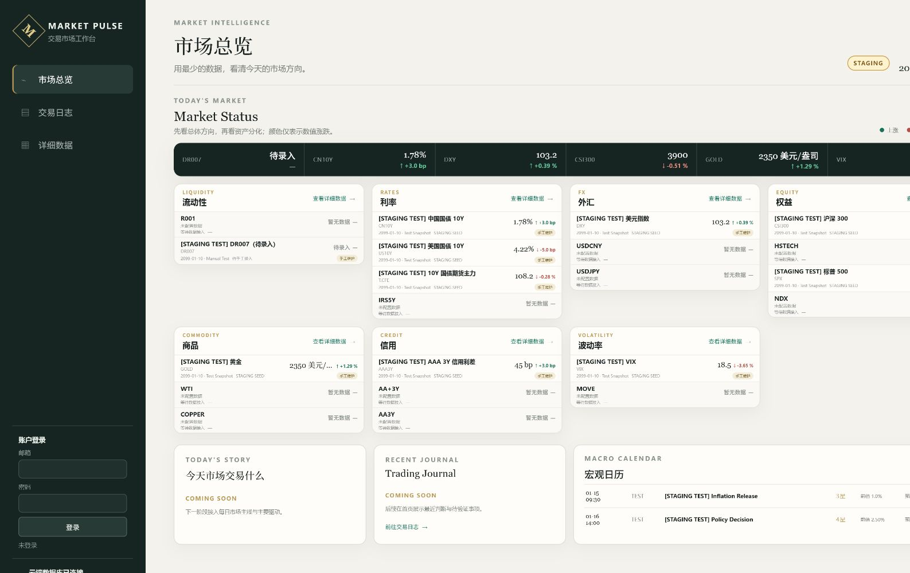
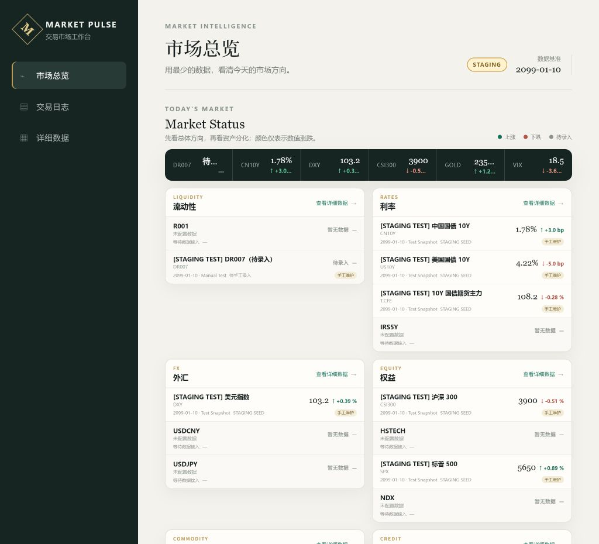
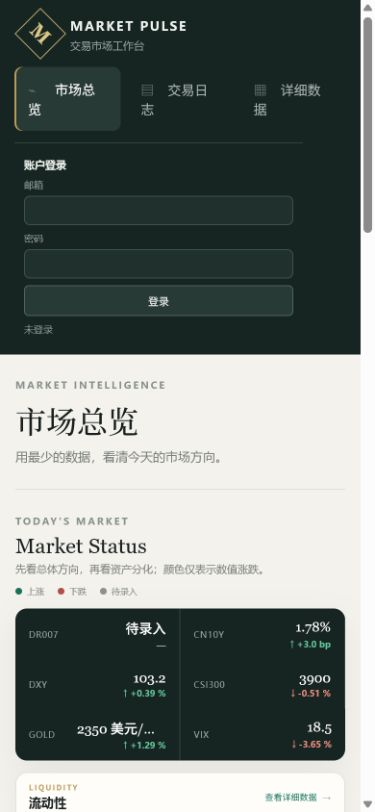

# Market Overview 2.0

## 背景

现有首页已经能够按资产类别展示指标，但首页层级仍接近数据列表。Product Foundation v1 需要让交易员先获得总体状态，再识别资产分化，并为后续 Daily Market 与 Journal 摘要预留稳定位置。

## 目标

- 用户在 30 秒内看到流动性、利率、外汇、权益、商品、信用和波动率状态。
- 桌面端首屏完整展示 Market Status；详细信息继续进入详细数据页。
- 保留宏观日历、认证、Journal、Editor 门禁和现有 API。
- Desktop、iPad、iPhone 使用同一 ES5 + XMLHttpRequest 渲染链。

## 非目标

不开发 AI Summary、新闻、自动数据源、Market Map、新 API、新表或新的 Journal 功能。

## 设计方案

信息层级固定为：

1. `Today's Market` 与六项跨资产 ticker，建立总体方向。
2. 七个统一 Market Status 卡片，展示代表指标、最新值、变化、日期、来源和维护方式。
3. `Today's Story` 与 `Recent Journal` 占位，明确未来内容位置但不伪造结论。
4. 宏观日历保留在首页下层，避免破坏现有工作流。

桌面使用四列紧凑卡片；常规笔记本和 iPad 使用两列；手机使用单列，并允许 ticker 横向浏览。首页状态使用局部语义色：上涨绿色、下跌红色、待录入灰色，不改变详细数据和 Journal 的既有样式。

## 兼容性

- 数据仍来自 `/api/dashboard-compat`。
- 不增加请求、不改变响应结构。
- 渲染继续使用 `var`、普通函数、字符串拼接和 XMLHttpRequest。
- 数据缺失时显示“暂无数据”，来源为待手工录入时显示“待录入”。

## 验收标准

- [x] 七个类别及代表指标正确显示
- [x] 颜色、圆角、间距、字号和阴影统一
- [x] “查看详细数据”保持可用
- [x] Story、Recent Journal 仅显示 Coming Soon
- [x] 宏观日历和原有页面不受影响
- [x] 自动测试全部通过
- [x] Desktop、iPad、iPhone 截图完成
- [ ] Staging 验收后才允许进入 Production Release Gate

## 视觉验收记录

三档视口均使用 Staging 数据完成只读浏览器验收。页面渲染 7 个类别、21 个指标槽位，无页面级横向溢出、卡片内部溢出或控制台错误。

### Desktop（1600 × 1000）

### iPad（1024 × 1366）

### iPhone（390 × 844）

## 风险与回滚

主要风险是窄屏文字重叠、Staging 缺少 Production 代表指标以及 CSS 覆盖旧全局规则。通过局部 `#overview` 选择器、缺失数据状态和三视口截图控制。回滚只需恢复 `public/index.html`、`public/app.js` 和 `public/overview.css`，不涉及数据库或 API。
